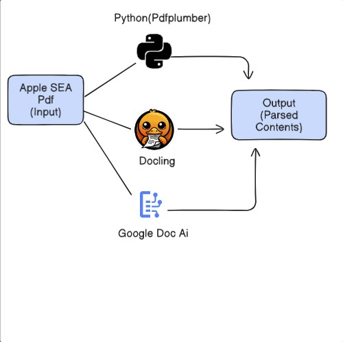

# report-intelligence
> End-to-end, reproducible pipeline for extracting, parsing, and **validating SEC 10-K/10-Q filings** with dual open-source parsers, optional **Google Document AI** benchmarking, **XBRL** cross-checks, and **DVC** for full reproducibility.

## Introduction
**Report Intelligence** automates EDGAR ingestion and turns raw filings into structured, verifiable data. The project runs two complementary open-source PDF paths (**pdfplumber** baseline and **Docling** unified layout), optionally benchmarks against **Google Document AI**, and validates key figures against **XBRL** to catch scaling/unit mismatches (e.g., “in millions”). All artifacts (Markdown/HTML/JSON, CSV tables, figures, page previews, layout boxes) and metrics are reproducible via **DVC**; embeddings can be built on top for search/QA over the parsed corpus.

**Scope at a glance**
- **Ingestion:** EDGAR download & staging of filings (10-K/10-Q).
- **Parsing (Open-Source):**  
  - **pdfplumber** — fast text-first extraction with optional OCR; baseline tables & word/line JSONL.  
  - **Docling** — layout + reading order; Markdown/HTML/JSON; robust tables, figures, page images, and bounding-box provenance.
- **Parsing (Cloud, optional):** **Google Document AI** for accuracy/runtime/cost comparison.
- **Validation:** **XBRL** cross-checks and unit normalization for high-confidence numeric extraction.
- **Reproducibility:** **DVC** pipelines track data, code, and outputs; embeddings for retrieval/QA (optional).

---

# PDF Understanding Project — pdfplumber + Docling + Google Document AI
> Layout-aware PDF parsing with side-by-side baselines and an optional cloud benchmark.

## Introduction
This project focuses on the **PDF understanding** component of the pipeline and compares three complementary approaches:

- **Baseline — pdfplumber:** prioritizes native PDF text (with OCR only when required), emitting word/line JSONL, baseline table CSVs, and optional figure crops for a fast, scalable path.
- **Unified — Docling:** performs layout detection and **reading-order reconstruction**, exporting clean Markdown/HTML/JSON, reliable table DataFrames, figures, page previews, and element-level **bounding-box provenance**.
- **Benchmark — Google Document AI (optional):** evaluates extraction quality, runtime, and cost against the open-source paths for complex or scanned filings.

Together, these paths produce consistent artifacts (Markdown/HTML/JSON, CSV tables, figures, page images, layout CSV/JSON) that can be inspected for fidelity (multi-column flows, borderless tables) and validated against **XBRL**. Use **pdfplumber** for speed on clean PDFs; use **Docling** when you need stronger structure; **Document AI** serves as an external benchmark on harder documents.

---

## Project Resources
- 🧪 **Google Codelab:** [Codelab Link](https://codelabs-preview.appspot.com/?file_id=1aLnoq6XdCcXZZRO0eS9cLNEjgD60BaRREO3g-e_7C2k#0)
- ▶️ **YouTube Demo:** *Demo Link* <!-- TODO: add the video URL -->

---

## Technologies
Python • pdfplumber • Docling • Pandas • (optional) Tesseract OCR • (optional) LayoutParser

---

## Architecture Diagram

---

## Project Flow

1) **Ingest & Stage (EDGAR)**
   - **Inputs:** SEC 10-K/10-Q PDFs (downloaded from EDGAR)  
   - **Process:** Normalize filenames, record basic metadata (ticker, CIK, filing date)  
   - **Outputs:** `data/upload/<company>/<file>.pdf`, `data/upload/index.csv`

2) **Parse PDFs (Open-Source & Cloud)**
   - **A. pdfplumber (baseline)**
     - Extract native text (OCR only if page is text-sparse), words/lines with coords, simple tables
     - **Outputs:**  
       - `data/parsed/plumber/text/<stem>.jsonl` (words/lines + bboxes)  
       - `data/parsed/plumber/tables/<stem>/table_*.csv`  
       - `data/parsed/plumber/figures/<stem>/...` *(optional)*  
       - `data/parsed/plumber/summary.csv` (pages, tables, timings)
   - **B. Docling (unified layout)**
     - Reading-order reconstruction, layout typing, page/figure rendering, robust table DataFrames
     - **Outputs:**  
       - `data/parsed/docling/md/<stem>.md` and `.html`  
       - `data/parsed/docling/json/<stem>.json` (DoclingDocument)  
       - `data/parsed/docling/tables/<stem>/table_*.csv`  
       - `data/parsed/docling/figures/<stem>/figure_*.png`  
       - `data/parsed/docling/pages/<stem>/page_*.png`  
       - `data/parsed/docling/layout/<stem>/{layout.json,bounding_boxes.csv}`  
       - `data/parsed/docling/summary.csv`
   - **C. Google Document AI (optional benchmark)**
     - Run a representative subset for quality/runtime/cost comparison
     - **Outputs:** `data/benchmarks/docai/<stem>/*` (text/table JSON), `data/benchmarks/summary.csv`

3) **Post-Processing & Normalization**
   - **Text:** whitespace & hyphen fixes, multi-column merge, section/title tagging
   - **Tables:** header normalization, merged-cell resolution, numeric coercion, long-form reshape
   - **Units/Scales:** detect “in thousands/millions,” percentages, parentheses-as-negatives → standardized numeric columns
   - **Keys/Joins:** add `(company, period, statement, concept)` to enable validation & analytics
   - **Outputs:** `data/curated/text/*.parquet`, `data/curated/tables/*.parquet`

4) **Validation, Evaluation & Reproducibility**
   - **XBRL Cross-Checks:** parse facts/contexts, map GAAP concepts, align periods/units, compare against PDF-extracted tables → discrepancy flags & confidence scores  
     - **Outputs:** `data/validated/matches.parquet`, `data/validated/mismatches.csv`
   - **Quality Metrics:**  
     - **Text:** WER/CER vs baseline/DocAI  
     - **Tables:** cell-level precision/recall/F1; coverage (tables found vs expected)  
     - **Structure:** figure counts, page-level coverage using bboxes  
     - **Outputs:** `metrics/*.json`, `reports/qa_notebook.ipynb` (overlays using `layout/bounding_boxes.csv`)
   - **Embeddings & Retrieval (optional):** build embeddings over Markdown to enable semantic search/QA with links back to page images & coordinates  
     - **Outputs:** `embeddings/index.faiss` (or equivalent), `demo/`
   - **DVC Pipeline:** define stages for plumber → docling → validation → benchmarks; track inputs/outs/metrics so runs are fully reproducible  
     - **Files:** `dvc.yaml`, `.dvc/`, updated `metrics/` and `plots/`

---

---

## Contributions
Name | Contribution
---|---

Teammate A | pdfplumber baseline
Swathi Jinka Radhakrishna | Docling pipeline, docling metadata, Google DocumentAI parsing, DVC
Teammate B | 

---

## Attestation
WE ATTEST THAT THIS WORK IS OUR OWN AND COMPLIES WITH THE POLICIES IN THE STUDENT HANDBOOK.

